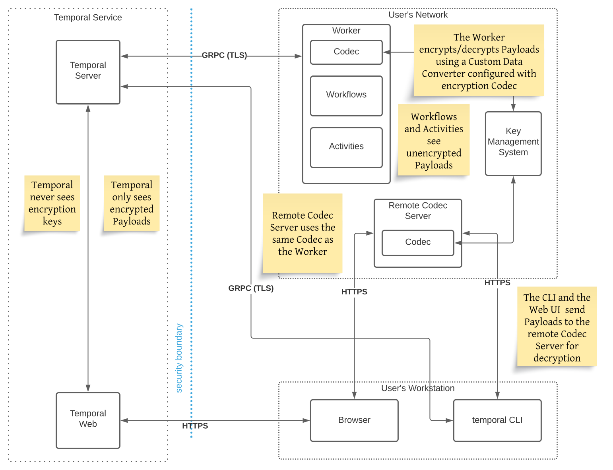

# [Temporal Codec Server][temporal-codec-server-guide]

## Késako ?

Temporal Server stores and persists the data handled in your Workflow Execution. Encrypting this data ensures that any sensitive application data is secure when handled by the Temporal Server.

Using encryption ensures that your sensitive data exists unencrypted only on the Client and the Worker Process that is executing the Workflows and Activities, on hosts that you control.

To run [data encoding/decoding remotely][temporal-rde-doc] (*via Temporal UI / CLI*), use a Codec Server. A Codec Server is an HTTP server that uses your **custom Codec logic** (*This logic must reside in a [shared library](../temporal-codecs-converters-shared), because Client Application, Workers and Codec Server need it*) to decode your data remotely. The Codec Server is independent of the Temporal Service and decodes your encrypted payloads through predefined endpoints. You create, operate, and manage access to your Codec Server in your own environment. The Temporal CLI and the Web UI in turn provide built-in hooks to call the Codec Server to decode encrypted payloads on demand.



## Configure Codec Server

First install this Codec custom logic in the Maven Repository Local :

```bash
pushd ../temporal-codecs-converters-shared
mvn clean install
popd 
```

Import Custom Codec Logic to Codec Server :
```xml
<dependency>
    <groupId>me.nzuguem</groupId>
    <artifactId>temporal-codecs-converters-shared</artifactId>
    <version>1.0.0</version>
</dependency>
```

Define imported Codecs as bean Injectable by Quarkus :

```java
public class CodecConfiguration {

    @ConfigProperty(name = "application.symmetric-codec.key")
    private String secretKey;

    // In Quarkus, you can skip the @Produces annotation completely
    // if the producer method is annotated with a scope annotation, a stereotype or a qualifier.
    // @Produces
    @ApplicationScoped
    public PayloadCodec codecDataConverter() throws GeneralSecurityException {
        return new ChainCodec(List.of(new IdentityCodec(), new SymmetricEncryptionCodec(secretKey)));
    }
}
```

## Test

> ℹ️ You must have a Workflow execution whose payload has been encoded with the Custom Logic Codec.

Start Codec Server :

```bash
quarkus dev
```

### Temporal CLI

```bash
temporal workflow show \
  --codec-endpoint "http://localhost:8080" \
  --namespace "default" \
  --workflow-id "yourWorkflow"
```

### Temporal Web UI

[Register Hooks of Codec Server][temporal-rde-web-ui]

<!-- Links -->
[temporal-codec-server-guide]: https://docs.temporal.io/production-deployment/data-encryption
[temporal-rde-doc]: https://docs.temporal.io/dataconversion#remote-data-encoding
[temporal-rde-web-ui]: https://docs.temporal.io/production-deployment/data-encryption#web-ui