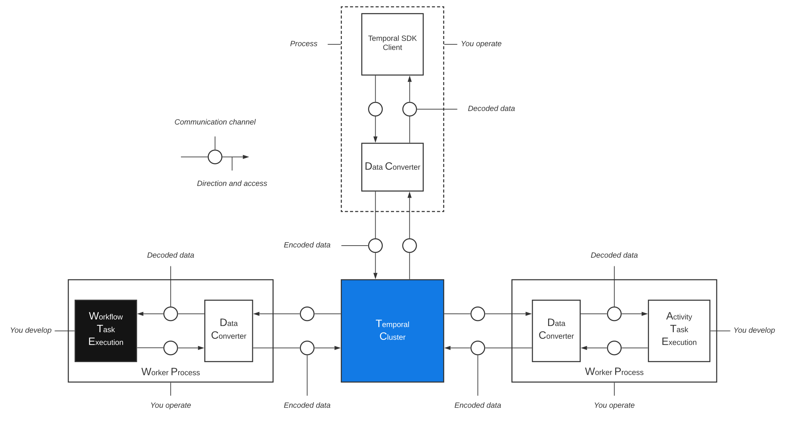

# Temporal Codecs/Converters Shared

## Késako ?

Example of a shared library of [Temporal IO][temporal-io] components : [**Payload Codec**][temporal-payload-codec-doc] and [**Payload Converter**][temporal-payload-converter-doc].

It must be shared between all Workers and the client application (the application that starts the workflow) Temporal. 

It can also be shared with the Codec Server in the case of [**Remote Data Encoding (RDE)**][temporal-rde-doc].



## Publish 
You are free to configure the publication of this library on your corporate repository. BUT as this is an example, we're going to publish it to the local Maven Repository :

```bash
mvn clean install
```

## Usage

### Import library to Build System
Maven :
```xml
<dependency>
    <groupId>me.nzuguem</groupId>
    <artifactId>temporal-codecs-converters-shared</artifactId>
    <version>1.0.0</version>
</dependency>
```

Gradle :
```kotlin
dependencies {
    implementation("me.nzuguem:temporal-codecs-converters-shared:1.0.0")
}
```

### Configure Temporal java SDK : `WorkflowClient`

```java
import io.temporal.client.WorkflowClientOptions;
import io.temporal.common.converter.CodecDataConverter;
import io.temporal.common.converter.DefaultDataConverter;
import me.nzuguem.temporal.shared.payloads.codecs.IdentityCodec;
import me.nzuguem.temporal.shared.payloads.codecs.SymmetricEncryptionCodec;

import java.util.List;

// gRPC stubs wrapper that talks to the local docker instance of temporal service.
WorkflowServiceStubs service = ...;

var options = WorkflowClientOptions.newBuilder()
        .setDataConverter(
                new CodecDataConverter(
                        DefaultDataConverter.newDefaultInstance(),
                        List.of(new IdentityCodec(), new SymmetricEncryptionCodec("secretKey")), true))
        .build();
// client that can be used to start and signal workflows
WorkflowClient client = WorkflowClient.newInstance(service, options);
```

<!-- Links -->
[temporal-io]: https://temporal.io/
[temporal-payload-codec-doc]: https://docs.temporal.io/dataconversion#payload-codec
[temporal-payload-converter-doc]: https://docs.temporal.io/dataconversion#payload-converter
[temporal-rde-doc]: https://docs.temporal.io/dataconversion#remote-data-encoding